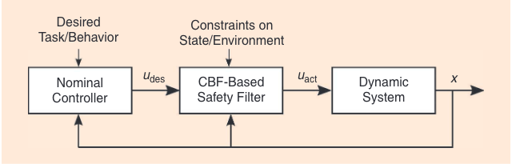

---
tags:
  - ControlTheory
---
## System description

- ### Nonlinear system
$$\dot{x} = f(x) + g(x)u$$
- ### Control Barrier Function (CBF)
	- 연속적이고 미분가능한 함수 $h(x) \in R$ 가 존재
	- 집합 $S$ 를 $h(x)$ 로 정의
		- $S = \{x \in R^n: h(x) \geq 0 \}$
		- $\partial S = \{x \in R^n: h(x) = 0 \}$
	- $(\partial h/ \partial x)(x) \neq 0 ~\forall x \in \partial S$ 이면 **함수 $h(x)$ 는 CBF**이다.

- ### h(x) 가 CBF가 되는 조건
$$\sup_{u} [ \frac{dh(x)}{dt} = \frac{\partial h}{\partial x}f(x) +   \frac{\partial h}{\partial x}g(x)u \geq -\alpha(h(x))]$$

## Controller design

- ### Issues
	- $h(x)$ 가 CBF를 만족하는 $u$를 찾기가 어려움
	- $u$를 찾아도 안전성을 만족할 뿐이지 시스템의 제어하는 원래 목적인 안정성 확보, 원하는 성능 보장은 확보 할 수 없음
- 안정성 및 성능을 보장하는 제어기를 먼저 설계 후 그 제어입력과 가장 비슷하면서 CBF 조건을 만족하는 입력을 구한다면 안전성까지 만족 할 수 있음
- 위의 아이디어를 QP로 변환
$$u_{opt} = \arg\min_{u} || u - u_{des}||^2 ~~\text{s.t.} ~~\frac{dh(x)}{dt} = \frac{\partial h}{\partial x}f(x) +   \frac{\partial h}{\partial x}g(x)u \geq -\alpha(h(x))$$
- 여기서 $\alpha(\cdot)$ 함수는 보통 $\gamma h(x)$ $(\gamma >0)$사용
- $\gamma$ 가 크면 $h(x)$의 변화율의 허용 범위가 커져서 $u$를 구하기는 쉽지만 $x$가 안전 영역의 경계까지 갈 수 있어서 실제 시스템에서는 안전을 보장 못 할 수 있음
- $\gamma$가 작으면 안전을 보장할 수 있는 $u$를 구할 수 있지만 QP의 해의 범위가 좁아져서 해를 못 구할 수도 있음   

## Discussion
- **$\gamma$ 값을 어떻게 적절하게 구할 것 인가?**
-  **$\alpha(\cdot)$ 함수를 다른 함수로 사용 가능 한가?**
- **실제 시스템에 적용 할 때 feasible solution 을 적절한 시간안에 구할 수 있는가?**

## Reference
- Ferraguti, F.; Landi, C.T.; Singletary, A.; Lin, H.-C.; Ames, A.; Secchi, C.; Bonfè, M. Safety and Efficiency in Robotics: The Control Barrier Functions Approach. _IEEE Robot. Automat. Mag._ **2022**, _29_, 139–151, doi:[10.1109/MRA.2022.3174699](https://doi.org/10.1109/MRA.2022.3174699).