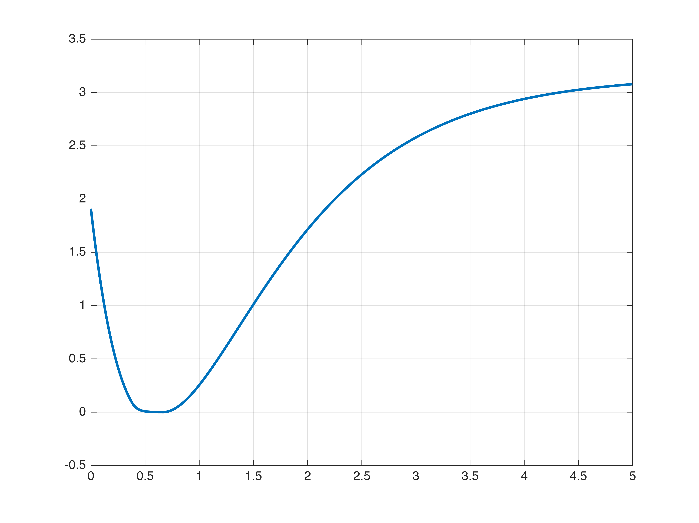
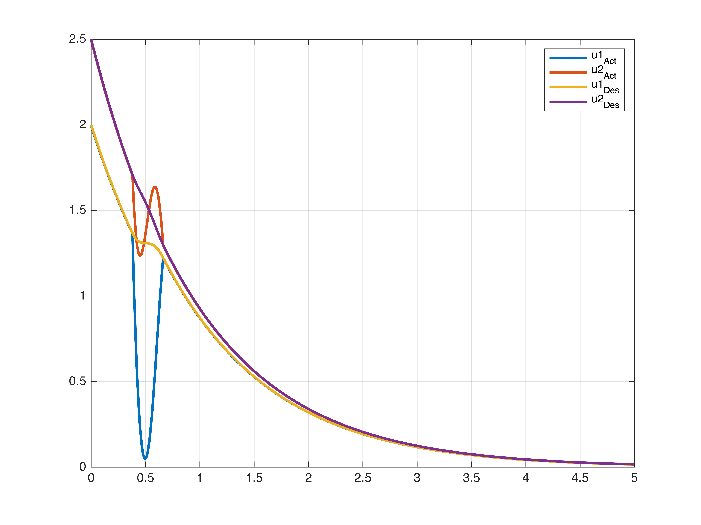

#ControlTheory #Programming 

## System description

- Single integrator dynamics
$$\dot{x}(t) = u(t)$$
- State equation으로 모델링
	- $\dot{x} = f(x) + g(x)u$
	- $x = [x_1, x_2]^T$, $f(x) = [0, 0]^T$ , $g(x) = \begin{bmatrix} 1 & 0\\ 0 & 1 \end{bmatrix}$
- 안전 영역
	- Obstacle의 이차원 평면의 원이고 중심은 $x_{obs}$ 반지름은 $R$
	- Obstacle을 제외한 영역이 안전영역

## CBF design

- Obstacle을 바깥영역에서 $h(x) \geq 0$되도록 설정
-  $h(x) = ||x - x_{obs}||^2 - R^2$

## Simulation

- [Matlab 사용해서 simulation](./Matlab에서%20CBF%20구현.md)
- Source code
	- [Script](../src/CBF_for_2Dof.mlx)
	- [Simulink](../src/CBF_for_2Dof.slx)

## Simulation Result

### Tracking with Constraint

### The values of the CBF

### Actual and desired input

## Reference
- Ferraguti, F.; Landi, C.T.; Singletary, A.; Lin, H.-C.; Ames, A.; Secchi, C.; Bonfè, M. Safety and Efficiency in Robotics: The Control Barrier Functions Approach. _IEEE Robot. Automat. Mag._ **2022**, _29_, 139–151, doi:[10.1109/MRA.2022.3174699](https://doi.org/10.1109/MRA.2022.3174699).