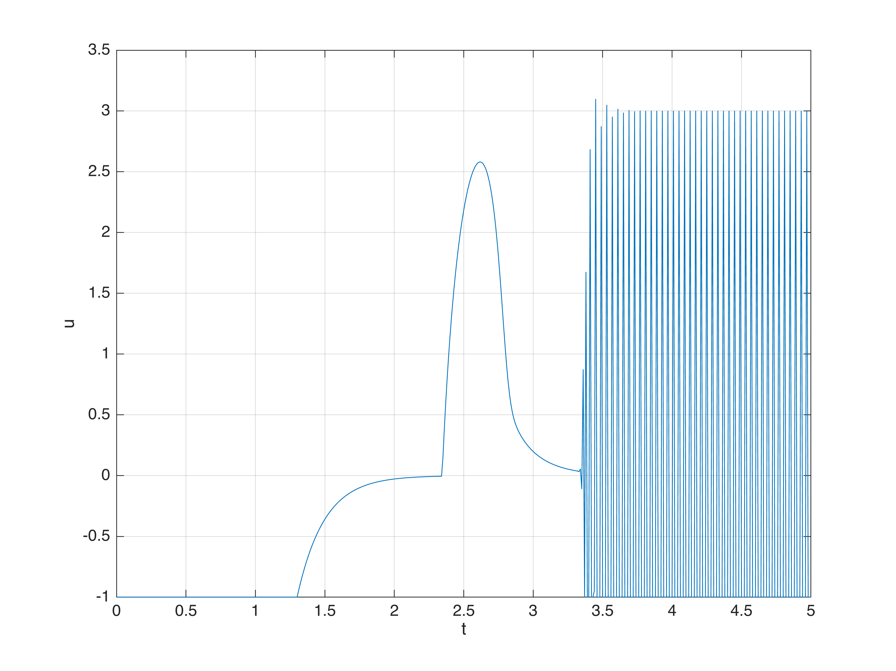

## System description

- 질량 시스템
$$M \ddot{p}(t) = u(t)$$
- State equation으로 모델링
	- $\dot{x} = f(x) + g(x)u$
	- $x = [p, v]^T$, $f(x) = [v, 0]^T$ , $g(x) = [0, M]^T$
- 안전 영역
	- $p_m \leq p \leq p_M$
	- $v_m \leq v \leq v_M$

## CBF design

- 안전 영역의 경계 위치($p_m, p_M$)에 가까이 갈때 속도의 제한($v_m, v_M$)이 있기 때문에 가속도도 고려해서 $h(x)$ 설계
- 위치의 최소, 최대 값, 속도의 최소, 최대값에 대한 4가지 함수 정의

## Simulation

- [Matlab 사용해서 simulation](./Matlab에서%20CBF%20구현.md)
- Source code
	- [Script](../src/CBF_for_DoubleInteg.mlx)
	- [Simulink](../src/CBF_for_DoubleInteg.slx) 

## Simulation Result

### Tracking with Constraint

### Control input

## 참고문헌

- Ferraguti, F.; Landi, C.T.; Singletary, A.; Lin, H.-C.; Ames, A.; Secchi, C.; Bonfè, M. Safety and Efficiency in Robotics: The Control Barrier Functions Approach. _IEEE Robot. Automat. Mag._ **2022**, _29_, 139–151, doi:[10.1109/MRA.2022.3174699](https://doi.org/10.1109/MRA.2022.3174699).