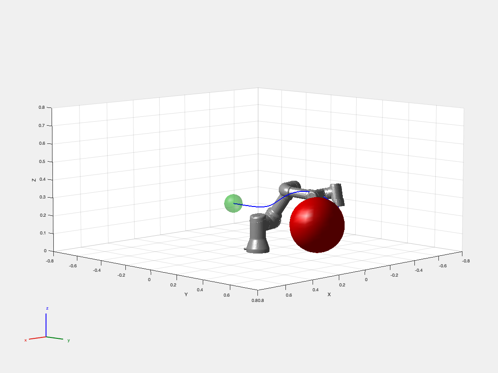
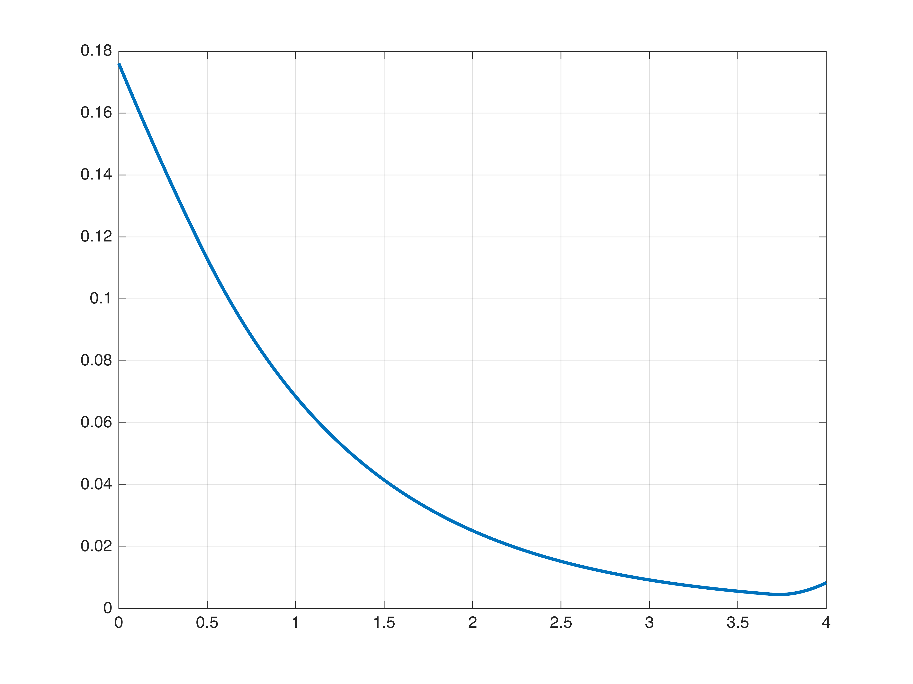
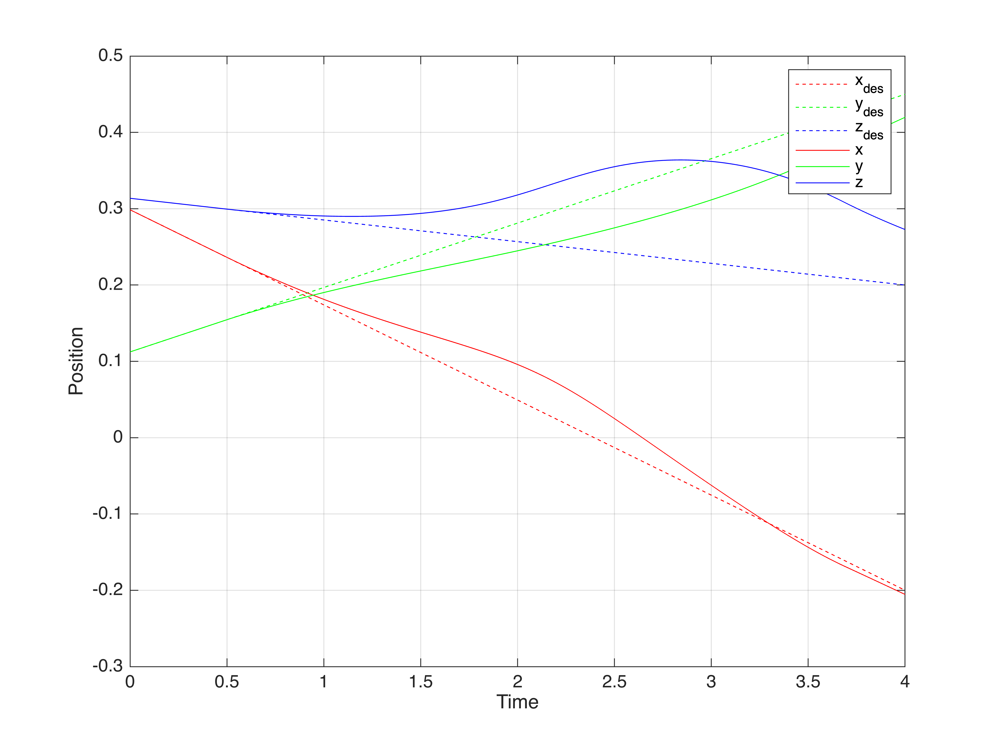

#ControlTheory #Programming 

## System description

- Forward kinematics
$$x = y(q)$$
- Jacobian matrix
$$\dot{x} = J_y(q)\dot{q}$$
- 속도 제어(Feedback controller)
$$\dot{q}(t) = u(t)=K(q,t)$$
- Kinematic trajectory tracking
	- $e(t) = x(t) - x_d(t)$
	- $\dot e(t) = J_y(q)\dot{q}  - \dot{x}_d(t)$
	- Choose $\dot{e}(t) = \lambda e(t)$, then $e(t) = \exp(\lambda t)e(0)$
	- Controller: $u(t) = \dot{q}(t) = J_y(q)^T (J_y(q)J_y(q)^T)^{-1} (\dot{x}_d(t) - \lambda e(t))$
- State equation으로 모델링
	- Forward kinematics가 완벽하다는 가정하에 $q$에 대한 시스템으로 표현
	- $\dot q = u$
	- $f(x) = 0$ , $g(x) = I$
- 안전 영역
	- Obstacle은 구이고 중심은 $x_{obs}$ 반지름은 $R$
	- 로봇 wrist 부분에도 일정 공간의 여유를 두어서 충돌 방지 $R_w$
	- Obstacle을 제외한 영역이 안전영역
	- 로봇의 wrist 만 충돌 고려

## CBF design

- Obstacle을 바깥영역에서 $h(x) \geq 0$되도록 설정
-  $h(x) = h(y(q)) = h(q) = ||x - x_{obs}||^2 - (R + R_w)^2$

## Simulation

- [Matlab 사용해서 simulation](./Matlab에서%20CBF%20구현.md)
- Source code
	- [Script](../src/CBF_for_KinematicControl_UR3.mlx)
	- [Simulink](../src/CBF_for_KinematicControl_UR3.slx)
- $\gamma$ 가 클수록 $h$의 변화율의 범위가 크기 때문에 $h$가 거의 0에 가까운 값을 가질 수 있고 이 때문에 obstacle에 더 가깝게 로봇이 움직임

## Simulation Result

### Tracking with Constraint

### The values of the CBF

### Actual and desired position of wrist

## 참고문헌

- A. Singletary, S. Kolathaya, and A. D. Ames, “Safety-Critical Kinematic Control of Robotic Systems,” _IEEE Control Syst. Lett._, vol. 6, pp. 139–144, 2022, doi: [10.1109/LCSYS.2021.3050609](https://doi.org/10.1109/LCSYS.2021.3050609).