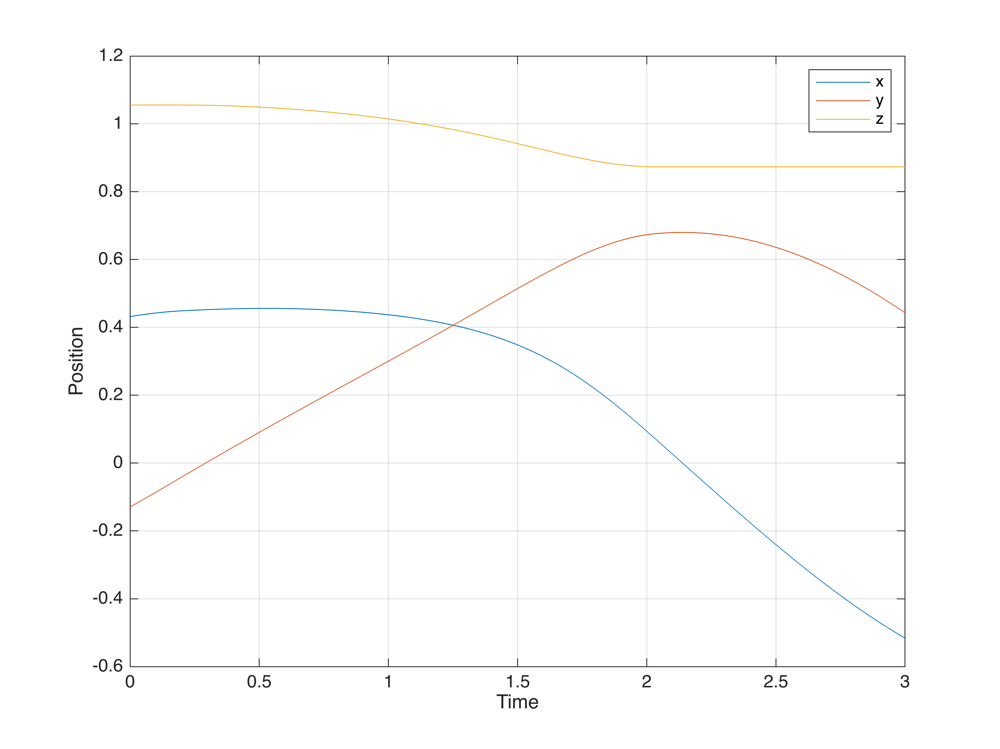

#ControlTheory #Programming 

## System description

- Forward kinematics
$$p = F(q)$$
- Jacobian matrix
$$\dot{p} = J(q)\dot{q}$$
- Single integrator dynamics 로 시스템 모델링 (속도 제어)
$$\dot{q}(t) = u(t)$$
- State equation으로 모델링
	- $\dot{x} = f(x) + g(x)u$
	- $x = [x_1, x_2]^T$, $f(x) = 0$ , $g(x) = I \in R^{6 \times 6}$
- 안전 영역
	- Obstacle은 구이고 중심은 $x_{obs}$ 반지름은 $R$
	- 로봇 wrist 부분에도 일정 공간의 여유를 두어서 충돌 방지 $R_w$
	- Obstacle을 제외한 영역이 안전영역

## CBF design

- Obstacle을 바깥영역에서 $h(x) \geq 0$되도록 설정
-  $h(p) = ||p - p_{obs}||^2 - (R + R_w)^2$

## Simulation

- [Matlab 사용해서 simulation](./Matlab에서%20CBF%20구현.md)
	- Source code
		- [Script](../src/CBF_for_manipulator.mlx)
		- [Simulink](../src/CBF_for_Manipulator.slx)
- [Matlab with cvxpy](./Matlab%20with%20cvxpy.md)
	- Source code
		- [Matlab Script](../src/manipulator_CBF_cvxpy.mlx)
		- [Simulink](../src/manipulator_CBF_cvxpy.slx)
		- [Python code](../src/manipulator_CBF_cvxpy.py)
- $\gamma$ 가 클수록 $h$의 변화율의 범위가 크기 때문에 $h$가 거의 0에 가까운 값을 가질 수 있고 이 때문에 obstacle에 더 가깝게 로봇이 움직임

## Simulation Result

### Tracking with constraint

### The vaue of CBF

### Position of the wirst

## 참고문헌

- Ferraguti, F.; Landi, C.T.; Singletary, A.; Lin, H.-C.; Ames, A.; Secchi, C.; Bonfè, M. Safety and Efficiency in Robotics: The Control Barrier Functions Approach. _IEEE Robot. Automat. Mag._ **2022**, _29_, 139–151, doi:[10.1109/MRA.2022.3174699](https://doi.org/10.1109/MRA.2022.3174699).